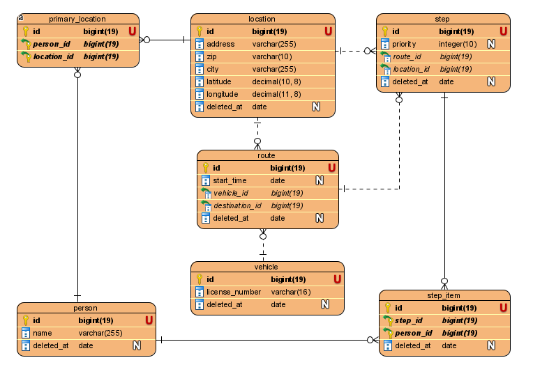

# Route Management
Creating and managing routes. Primarly focuses on human transport.

## Requirements
### Backend:
* Java JRE
* Maven
* MariaDB Database (Docker)

### Frontend:
* Node & NPM

## How to run
1. Copy `.env.template` and rename it as `.env` to configure environment variables
2. Setup database
  * Database can be set up with Docker or docker-compose:
    * With Docker: `docker run -d --name route-management-db
    -e MYSQL_USER=test-e MYSQL_PASSWORD=test -e MYSQL_DATABASE=route-management
    -e MYSQL_ROOT_PASSWORD=test -p 3306:3306 mysql:5.7 --skip-name-resolve`
    * With Docker-Compose: `docker-compose up -d`
  * `mvn liquibase:dropAll` to clear database.
3. Setup java server
  * `mvn install` to install dependencies. Usually IDEs do this automatically.
  * `mvn package` to to setup project.
  * `mvn clean` if everything else fails and retry.
4. Running java server
  * `java -jar target/route-management-1.0-SNAPSHOT.jar` to run backend.

## Development
  * This project uses Snoozy, which comes automatically configured with Jubics Checkstyle.
  Install CheckStyle plugin to your IDE and add new config: `https://raw.githubusercontent.com/jubicoy/checkstyle/master/src/main/resources/checkstyle.xml`
  * When using dependency injection, often times program doesn't rerun without error.
  Run `mvn clean` and rerun backend to fix this.
  * When creating db migrations, use `mvn jooq-codegen:generate` to generate new classes to db package.
  If software doesn't rerun because of foreign key issues, run `mvn liquibase:dropAll` to clear database.
  * When creating commit, make sure that your application (front & back) doesn't have errors `mvn test` & `npm run test`.

## Development environment
Environment variables can be seen in `.env.template` file.
Renaming `.env.template` to `.env` applies env variables. `.env.template` contains default development env variables.

* `DBUNIT_RUN` defaults: `false`. This defines whether to run populate to db on run. Populate is based on `/src/main/resources/dataset.xml`
* `SERVER_PORT` defaults `8080`. Can be changed freely if port is not free.
* `SERVER_HOST` defaults `127.0.0.1 (localhost)`. Optional. If planning to use localhost as host ip, this doesn't need to be set.

Rest of the variables are self explanatory and can be found in `.env.template` file.

## Database structure

### Version MVP:

